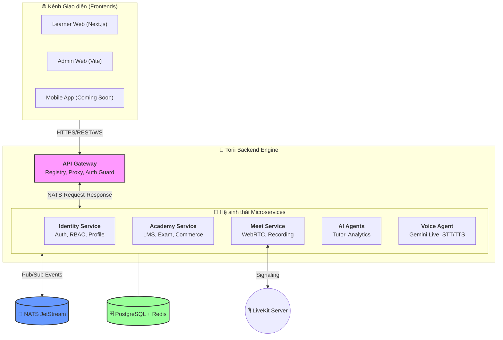

# 🏯 Torii Nihongo Monorepo

> **Hệ sinh thái học tiếng Nhật thế hệ mới** tích hợp công nghệ AI Tutor (FastMCP, Gemini Live) và Live Class (WebRTC). Monorepo này được thiết kế với kiến trúc **Microservices** hiện đại, sử dụng **NATS JetStream** làm xương sống giao tiếp và **Turborepo** để quản lý hiệu năng.

[](https://microservices.io/)
[](https://nestjs.com/)
[](https://nats.io/)
[](https://www.postgresql.org/)

---

## 🌐 Hệ thống Tên miền (Domains)

| Dịch vụ | URL | Mô tả |
| :--- | :--- | :--- |
| **Backend API** | [api.torii.sbs](https://api.torii.sbs) | Điểm truy cập duy nhất (Gateway) cho toàn bộ hệ thống. |
| **Learning Platform** | [app.torii.sbs](https://app.torii.sbs) | Cổng thông tin học tập dành cho học viên (Next.js). |
| **Live Meet** | [meet.torii.sbs](https://meet.torii.sbs) | Hệ thống lớp học trực tuyến WebRTC. |
| **Admin Dashboard** | [admin.torii.sbs](https://admin.torii.sbs) | Công cụ quản trị dành cho Giáo viên & Quản lý. |

---

## 🏗 Kiến trúc Hệ thống (New Architecture)

Dự án áp dụng mô hình **Hybrid Cloud Architecture** kết hợp giữa tính đồng bộ của **REST/gRPC** và tính linh hoạt của **Event-Driven Design**.

### 🏛 Sơ đồ Luồng dữ liệu (Hub-and-Spoke Microservices)



---

## 🧩 Chi tiết các Microservices

### 1. 🛡 Identity Service (Định danh & Bảo mật)
Trung tâm quản lý người dùng và quyền hạn.
*   **Auth Module**: Đăng nhập đa phương thức (Email, Google OAuth2).
*   **2FA**: Bảo mật 2 lớp qua TOTP ứng dụng.
*   **RBAC**: Phân quyền dựa trên vai trò (Student, Teacher, Admin).
*   **Audit Logger**: Lưu vết hoạt động hệ thống nhằm mục đích bảo mật và hoàn tác.
*   **Notification**: Tích hợp Email (SendGrid/SMTP) và In-app notification.

### 2. 📚 Academy Service (Lõi LMS - Học thuật)
Dịch vụ lớn nhất, quản lý toàn bộ nội dung giáo dục.
*   **Content Engine**: Quản lý Course, Module, Lesson đa phương tiện.
*   **Assessment & Exam**: Hệ thống ngân hàng câu hỏi, tạo đề thi tự động và chấm điểm Real-time.
*   **Classroom Management**: Quản lý lớp học, lịch học, điểm danh và tiến độ học viên.
*   **Commerce (PayOS)**: Tích hợp thanh toán khóa học, quản lý mã giảm giá (Coupon) và hóa đơn.
*   **SRS Flashcards**: Thuật toán lặp lại ngắt quãng giúp ghi nhớ từ vựng hiệu quả.
*   **Gamification**: Hệ thống Streak, XP và Huy chương (Achievements).

### 3. 🎥 Meet Service (Lớp học Trực tuyến)
Xây dựng trên nền tảng **LiveKit**, tối ưu cho dạy học ngoại ngữ.
*   **WebRTC Integration**: Truyền tải âm thanh/hình ảnh độ trễ thấp.
*   **Artifacts & Recording**: Ghi hình buổi học, lưu trữ tài liệu đã chia sẻ.
*   **Interactive Tools**: Thăm dò ý kiến (Polls), chia phòng (Breakout rooms), Bảng trắng (Whiteboard).
*   **AI Insights**: Phân tích biểu cảm học viên, tự động tạo phụ đề (Speech-to-Text).

### 4. 🤖 AI Agents & Voice Agent (Trợ lý Sensei)
Sức mạnh vượt trội của Torii.
*   **Sensei Agent**: Giải thích ngữ pháp, sửa bài tập và dịch thuật ngữ cảnh.
*   **Gemini Live Integration**: Giao tiếp bằng giọng nói trực tiếp với AI để luyện phản xạ.
*   **FastMCP Architecture**: Cho phép AI truy cập vào database dự án để đưa ra tư vấn chính xác nhất về tiến độ học tập.
*   **TTS Service**: Sử dụng Microsoft Azure Neural voices cho phát âm chuẩn Nhật.

---

## 🛠 Công nghệ Sử dụng (Tech Stack)

*   **Ngôn ngữ**: TypeScript, Python (cho AI/TTS).
*   **Framework**: 
    *   Backend: [NestJS](https://nestjs.com/) (Microservices mode).
    *   Frontend: [Next.js](https://nextjs.org/), [Vite](https://vitejs.dev/), [React](https://reactjs.org/).
*   **Infrastructure**: 
    *   Messaging: [NATS JetStream](https://nats.io/).
    *   Media: [LiveKit](https://livekit.io/).
    *   ORM/DB: [Prisma](https://www.prisma.io/), [PostgreSQL](https://www.postgresql.org/), [Redis](https://redis.io/).
*   **AI/ML**: Google Gemini (Flash/Pro/Live), Azure Cognitive Services.
*   **DevOps**: Docker, TurboRepo, PNPM Workspaces.

---

## 📂 Cấu trúc Thư mục

```bash
torii-monorepo/
├── apps/
│   ├── server/             # Backend Workspace (NestJS)
│   │   ├── services/       # 5 Microservices chính (Gateway, Identity, Academy, Agents, Meet)
│   │   └── libs/           # Thư viện dùng chung (Shared logic, NATS Proxy, Prisma)
│   ├── web-learner/        # 🎓 Giao diện Học viên (Next.js)
│   ├── web-admin/          # ⚙ Giao diện Quản trị (Vite + React)
│   ├── meet/               # 📹 Ứng dụng WebRTC chuyên biệt
│   └── voice-agent/        # 🎙 Dịch vụ AI Voice Agent (Gemini Live)
├── packages/               # Shared Packages (@workspace/*)
│   ├── protocol/           # Định nghĩa Protobuf cho NATS/LiveKit
│   ├── schemas/            # Zod schemas & DTO dùng chung cho BE & FE
│   ├── ui/                 # Design System (Tailwind + Shadcn/ui)
│   └── typescript-config/  # Cấu hình compiler tập trung
└── deploy/                 # Docker Compose & K8s config
```

---

## 🚀 Hướng dẫn Bắt đầu (Quick Start)

### 1. Cài đặt Cơ sở hạ tầng
```bash
docker compose up -d # Khởi chạy NATS, DB, Redis, LiveKit
```

### 2. Cài đặt Dependencies
```bash
pnpm install
```

### 3. Thiết lập Môi trường & Database
```bash
cp .env.example .env
# Đồng bộ Database schema
cd apps/server
npx prisma generate
npx prisma db push

# Build shared packages
pnpm --filter @workspace/schemas run build
pnpm --filter @workspace/protocol run generate
pnpm --filter @workspace/protocol run build
```

### 4. Khởi chạy Chế độ Phát triển
```bash
pnpm dev # Chạy toàn bộ hệ thống
# HOẶC chạy riêng Backend
pnpm --filter server dev
```

### 5. Docker Deployment (VPS)
```bash
# Cập nhật và triển khai image mới
docker compose pull
docker compose up -d
# Dọn dẹp tài nguyên thừa
docker image prune -f
```
---

## 📐 Nguyên tắc Thiết kế (Design Principles)

1.  **Protocol-First**: Mọi giao tiếp giữa các service phải được định nghĩa qua Protobuf hoặc Shared Schemas.
2.  **Stateless Services**: Các microservice không lưu trạng thái cục bộ, cho phép scale ngang dễ dàng.
3.  **Eventual Consistency**: Sử dụng NATS JetStream để đảm bảo tính nhất quán dữ liệu qua các sự kiện.
4.  **Security-First**: Mọi request qua Gateway đều được kiểm tra bởi JWT Guard và RBAC policy.

---
**Torii Nihongo Team** - *Mang sức mạnh AI vào giáo dục tiếng Nhật.* 🗼🚀 
