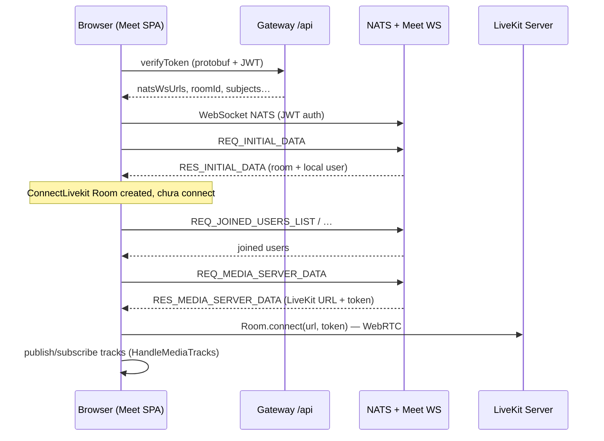

# Luồng Meet & WebRTC trong Torii Monorepo

Tài liệu mô tả **kiến trúc tổng quan**, **thứ tự chạy code** và **vai trò từng thành phần** cho ứng dụng Meet (`apps/meet`), dịch vụ backend Meet (`apps/server/services/meet`), Gateway và tích hợp Academy (live session).

---

## 1. Tổng quan kiến trúc

Meet trong dự án **không** chỉ là “một WebRTC peer-to-peer”. Thực tế là **hai lớp kết nối song song**:

| Lớp | Công nghệ | Mục đích |
|-----|-----------|----------|
| **Tín hiệu & dữ liệu phòng** | **NATS** (WebSocket + JetStream) | Metadata phòng, danh sách người tham gia, chat, whiteboard, sự kiện hệ thống, worker xử lý join token / renew token |
| **Media thời gian thực** | **LiveKit** (`livekit-client`) | Âm thanh, video, màn hình — WebRTC SFU (media đi qua máy chủ LiveKit) |

**WebRTC** (trong code) chủ yếu nằm ở **LiveKit Client SDK**: `Room.connect(url, token)`, publish/subscribe track (mic, camera, screen share).

**Protocol chính thức** cho metadata phòng & tạo phòng: **Protobuf** (`@workspace/protocol`, các file trong `packages/protocol/proto/`, ví dụ `wajlc_create_room.proto`, token, NATS messages).

---

## 2. Các package / app liên quan (trong monorepo)

| Vị trí | Vai trò |
|--------|---------|
| `apps/meet` | SPA React: UI phòng họp, kết nối NATS + LiveKit |
| `apps/server/services/meet` | Microservice NestJS: xử lý phòng, user, NATS handlers, tích hợp LiveKit server API (qua infrastructure) |
| `apps/server/services/gateway` | HTTP API: ví dụ `POST /api/verifyToken` (protobuf), các route meet khác; chuyển tiếp NATS |
| `apps/server/services/academy` | `live-schedule.service`: tạo phòng Meet (`room.create`), sinh join token (`user.generateJoinToken`) cho buổi live |
| `packages/protocol` | Định nghĩa Protobuf: `RoomMetadata`, `RoomCreateFeatures`, `VerifyToken*`, NATS messages |

---

## 3. Luồng người dùng từ product (Academy) → Meet

1. Học viên **đăng nhập** web-learner (JWT thường).
2. Gọi **`POST /api/live-sessions/:sessionId/join/student`** (hoặc join lecturer tương tự).
3. Academy service (`joinBySessionId`):
   - Kiểm tra quyền, cửa sổ giờ, trạng thái buổi.
   - Đảm bảo có `roomId` (đã tạo phòng hoặc tạo mới qua NATS `room.create` với metadata mặc định).
   - Gọi NATS **`user.generateJoinToken`** với `GenerateTokenReq` (roomId, userInfo, isAdmin, …).
   - Trả về client: **`token`**, `roomId`, `userId`, `roomTitle` (JWT dùng để mở Meet).

4. Client (learner) mở **Meet URL** (ví dụ `NEXT_PUBLIC_MEET_URL`) kèm **access token** (JWT) — thường query param; hàm `getAccessToken()` trong Meet đọc token này.

---

## 4. Luồng khởi động ứng dụng Meet (client)

### 4.1 `verifyToken` — chuẩn bị NATS

1. **`apps/meet/src/components/app/index.tsx`**
   - `useEffect` gọi **`verifyToken`** (`components/app/helper.ts`).

2. **`verifyToken`**
   - Lấy JWT từ URL (`getAccessToken()`).
   - Gọi HTTP **`verifyToken`** (protobuf): `VerifyTokenReq` → `VerifyTokenRes`.
   - Response thành công gồm: **`natsWsUrls`**, **`roomId`**, **`userId`**, **`roomStreamName`**, **`natsSubjects`**, `serverVersion`, v.v.
   - Lưu vào state **`openConnInfo`** (access token + các thông tin trên).

### 4.2 Kết nối NATS

3. Khi có `openConnInfo`, gọi **`startNatsConn`** (`helpers/nats/index.ts`).
4. **`ConnectNats.openConn()`** (`helpers/nats/connect-nats.ts`):
   - `wsconnect({ servers: natsWsUrls, authenticator: tokenAuthenticator(() => token) })` — JWT dùng làm **NATS auth**.
   - JetStream, message queue, subscribe:
     - **Room events** (consumer per user trên stream phòng),
     - **System public** pub/sub,
   - Gửi **`REQ_INITIAL_DATA`** tới system worker (NATS).

### 4.3 Dữ liệu ban đầu & chuẩn bị LiveKit (chưa WebRTC)

5. Server trả **`RES_INITIAL_DATA`** → **`handleInitialData`**:
   - `handleRoomData.setRoomInfo` → Redux: phòng, metadata (`roomFeatures`, `defaultLockSettings`, …).
   - `addLocalParticipantInfo` thông tin user local.
   - **`initializeMediaServer`**: tạo singleton **`ConnectLivekit`** (`createLivekitConnection`) — khởi tạo instance `Room` LiveKit, cấu hình codec, dynacast, E2EE nếu bật — **chưa gọi `connect()`**.

6. `roomConnectionStatus` chuyển sang **`ready`** (sau `RES_INITIAL_DATA`).

7. Từ **landing** (nếu có bước chờ), user xác nhận → **`finalizeAppConn()`**:
   - Gửi **`REQ_JOINED_USERS_LIST`**.
   - Nhận **`RES_JOINED_USERS_LIST`** → thêm danh sách người online → **`onAfterUserReady`**.

8. **`onAfterUserReady`** gửi **`REQ_MEDIA_SERVER_DATA`**.

9. Server trả **`RES_MEDIA_SERVER_DATA`** → **`handleMediaServerData`**:
   - Parse JSON **`MediaServerConnInfo`** (URL LiveKit + **LiveKit JWT**).
   - Gọi **`ConnectLivekit.initializeConnection(url, token)`**.

### 4.4 LiveKit — WebRTC thực sự

10. **`ConnectLivekit.initializeConnection`** (`helpers/livekit/connect-livekit.ts`):
    - `await this._room.connect(url, token)` — **đây là bước WebRTC handshake với LiveKit server**.
    - Sau khi connected: `initiateParticipants`, cập nhật trạng thái `media-server-conn-established`.

11. **`HandleMediaTracks`** lắng nghe `RoomEvent`:
    - `LocalTrackPublished` / `Unpublished`,
    - `TrackSubscribed` / `Unsubscribed` (remote),
    - Cập nhật Redux, audio manager, subscriber maps.

**Tóm lại:** WebRTC **chỉ** bắt đầu sau khi đã có **LiveKit URL + token** từ backend, không phải ngay khi mở trang.

---

## 5. Trạng thái `roomConnectionStatus` (tham chiếu UI)

Định nghĩa trong `components/app/helper.ts`, ví dụ:

- `loading` → đang verify token  
- `connecting` / `receiving-data` / `checking` → NATS  
- `ready` → đã có initial data, UI có thể hiện landing  
- `media-server-conn-start` / `media-server-conn-established` → LiveKit  
- `error` / `disconnected` — lỗi hoặc ngắt kết nối  

---

## 6. Gateway: `POST /api/verifyToken`

- **Controller:** `apps/server/services/gateway/src/modules/meet/controllers/user-room-setting.controller.ts`
- **Auth:** JWT (guard gắn `roomId`, `userId` từ token Meet).
- Body: **Protobuf** `VerifyTokenReq`.
- Kiểm tra trùng join (user đã online trong phòng).
- Forward sang NATS / meet service để trả về `VerifyTokenRes` (NATS URLs, subjects, …).

Meet client gọi API này qua helper (`sendAPIRequest('verifyToken', ...)`).

---

## 7. Backend Meet: sinh token LiveKit & quản lý phòng

- **Tạo phòng:** NATS command **`room.create`** với `RoomMetadata` (protobuf), gồm `room_features` (ví dụ `allow_webcams`, `mute_on_start`, …) — xem `packages/protocol/proto/wajlc_create_room.proto`.
- **Join token:** NATS **`user.generateJoinToken`** — Academy và flow chính thức đều dùng.
- **User metadata / lock:** `room-user.service.ts` — gán `defaultLockSettings` (mic/webcam lock) cho user khi join; admin có thể unlock khác quy tắc.

Chi tiết implementation nằm trong `apps/server/services/meet` (modules `room`, `auth`, …).

---

## 8. Tích hợp Academy (live session)

- File: **`apps/server/services/academy/src/modules/classroom/live-schedule/live-schedule.service.ts`**
- **`getDefaultRoomInfo` / `room.create`:** payload metadata phòng (tiêu đề, `roomFeatures`, …) khi tạo phòng cho buổi học.
- **`joinBySessionId`:** đảm bảo phòng active, `GenerateTokenReq` → `user.generateJoinToken` → trả JWT cho client mở Meet.

---

## 9. Media (mic / camera / màn hình) trên client

- **Mic / webcam:** `apps/meet/src/components/footer/icons/microphone.tsx`, `webcam.tsx` dùng **`getMediaServerConnRoom()`** → `LocalParticipant` LiveKit (`publishTrack`, `unpublishTrack`, `switchActiveDevice`, …).
- **Giới hạn theo phòng:** đọc `session.currentRoom.metadata.roomFeatures` (ví dụ `allowWebcams`, `adminOnlyWebcams`) và `lockWebcam` / `defaultLockSettings`.
- **Cấu hình codec / simulcast:** `ConnectLivekit.configureRoom()` — `VIDEO_CODEC`, `ENABLE_SIMULCAST`, `ENABLE_DYNACAST` từ `@/config`.

---

## 10. NATS dùng cho những gì (không phải WebRTC)

- Chat (pub/sub + private delivery qua worker),
- Whiteboard, data messages giữa client,
- Cập nhật participant, metadata phòng,
- Renew token (`REQ_RENEW_WAJLC_TOKEN`),
- Analytics, poll, breakout, …

Luồng **WebRTC media** vẫn **chỉ** qua **LiveKit** sau `connect(url, token)`.

---

## 11. Sơ đồ luồng (tóm tắt)

---

## 12. File nguồn nên đọc khi debug

| Chủ đề | File gợi ý |
|--------|------------|
| Boot Meet | `apps/meet/src/components/app/index.tsx`, `helper.ts` |
| NATS + thứ tự media | `apps/meet/src/helpers/nats/connect-nats.ts` |
| LiveKit connect | `apps/meet/src/helpers/livekit/connect-livekit.ts` |
| Track events | `apps/meet/src/helpers/livekit/handle-media-tracks.ts` |
| Singleton Room | `apps/meet/src/helpers/livekit/utils.ts` |
| Tạo phòng / join Academy | `apps/server/services/academy/.../live-schedule.service.ts` |
| Verify token HTTP | `apps/server/services/gateway/.../user-room-setting.controller.ts` |
| Proto phòng | `packages/protocol/proto/wajlc_create_room.proto` |

---

## 13. Lưu ý vận hành

- **Hai token khác nhau:** JWT trên URL (NATS + xác thực API) và **token LiveKit** trong `MediaServerConnInfo` — TTL và renew khác nhau (renew NATS JWT qua `REQ_RENEW_WAJLC_TOKEN`).
- **HTTPS:** Meet client yêu cầu HTTPS (trừ localhost) trước khi verify — xem `verifyToken` trong `helper.ts`.
- **Trùng tab:** Gateway có kiểm tra user đã `online` trong phòng để tránh join trùng.

---

*Tài liệu được tạo theo trạng thái codebase tại thời điểm viết; khi refactor NATS/LiveKit, cần cập nhật mục file path và tên event nếu thay đổi.*
