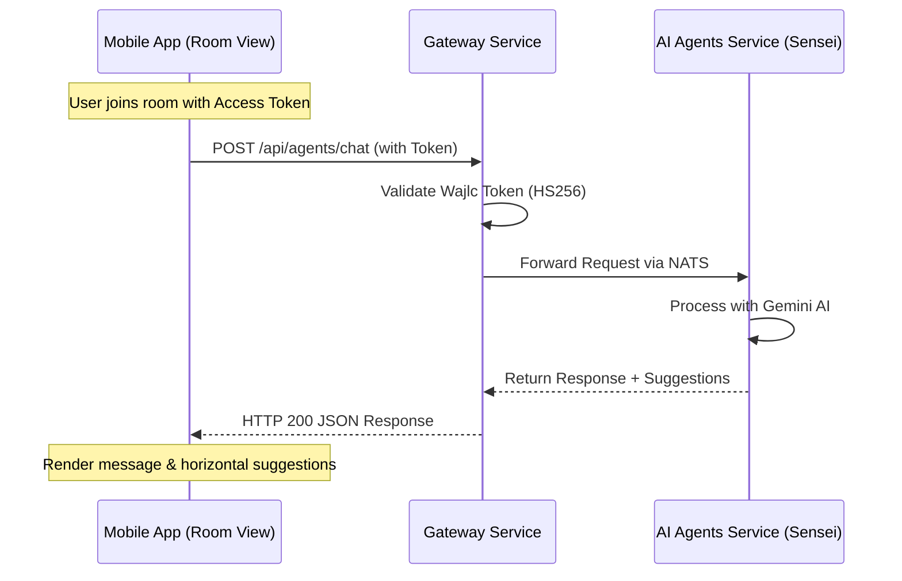

# AI Chatbot Meet Integration Guide (Mobile) - Detailed Specification

This document provides a comprehensive technical guide for integrating the AI Sensei chatbot into the mobile application's meeting interface.

## 1. System Architecture

The AI Chatbot in the Meet Room works as a REST-based service routed through the Gateway, independent of the real-time NATS communication used for media and room synchronization.



## 2. Authentication & Authorization

### The Token
Mobile clients must capture the `access_token` returned by the `LiveScheduleService.joinBySessionId` call (the standard join flow). 

- **Token Type**: JWT (Wajlc Claim format)
- **Injection**: The token must be sent in the `Authorization` header.
- **Example Header**:
  ```http
  Authorization: Bearer <YOUR_ROOM_TOKEN_HERE>
  ```

### Gateway Validation
The Gateway is configured to accept this token even if the user is not "logged in" via the standard Identity service, provided the token is a valid Room Access Token signed with the Wajlc API secret.

## 3. API Specification: `Sensei Chat`

### Endpoint Details
- **URL**: `POST {{GATEWAY_URL}}/api/agents/chat`
- **Content-Type**: `application/json`

### Request Structure (JSON)

| Field | Type | Description | Required |
| :--- | :--- | :--- | :--- |
| `message` | `string` | The current question or message from the user. | Yes |
| `history` | `Array` | Lịch sử cuộc hội thoại để giữ ngữ cảnh. | Yes |

**History Item Format**:
```json
{
  "role": "user" | "assistant",
  "content": "Nội dung tin nhắn"
}
```

### Response Structure (JSON)

| Field | Type | Description |
| :--- | :--- | :--- |
| `success` | `boolean` | Indicates if the request was processed successfully. |
| `data.message` | `string` | The AI response (markdown supported). |
| `data.suggestions` | `string[]` | (Optional) List of follow-up question chips. |

## 4. UI/UX Implementation Guide

### A. Component Anatomy
1. **Entry Point**: A floating button or a bottom action icon with the `Bot` (Robot) icon.
2. **Chat Container**: A sliding sheet (Bottom Sheet) or side panel that doesn't completely block the video view if possible (on tablets).
3. **Message Bubbles**: 
   - User: Right-aligned, colored background.
   - Assistant: Left-aligned, light grey/muted background.
4. **Typing Experience**: When receiving a response, append it to the chat history state. For better UX, implement a "typewriter" effect using a timer to stream the text into the view.

### B. Suggested Interaction Flow
- **Initialization**: Upon opening the chatbot for the first time in a session, the mobile app should pre-populate the `history` with a welcome message (e.g., "Konnichiwa! Mình là AI Sensei...").
- **Tapping Suggestions**: When a user taps a suggestion chip, the app should:
  1. Add the suggestion text as a `user` message to the UI.
  2. Send the message to the API.
  3. Enter loading state.

### C. Suggested UI States
- **Thinking State**: While waiting for the API, show a subtle pulse animation or "Sensei đang suy nghĩ...".
- **Empty State**: If it's the start of the session, just show the welcome message.
- **Error State**: Show a small inline error message with a "Gửi lại" (Retry) button.

## 5. Technical Recommendations (Code Snippets)

### State Management (React Native Example)
```javascript
const [messages, setMessages] = useState([
  { role: 'assistant', content: 'Chào bạn, mình giúp gì được cho bạn?' }
]);

const handleSendMessage = async (userText) => {
  // 1. Add user msg to UI
  const newMessages = [...messages, { role: 'user', content: userText }];
  setMessages(newMessages);
  
  // 2. Clear input & set loading
  setLoading(true);

  try {
    const response = await fetch(`${GATEWAY}/api/agents/chat`, {
      method: 'POST',
      headers: {
        'Authorization': `Bearer ${roomToken}`,
        'Content-Type': 'application/json'
      },
      body: JSON.stringify({
        message: userText,
        history: newMessages.slice(-10) // Limit context
      })
    });
    
    const result = await response.json();
    if (result.success) {
      // 3. Add AI msg to UI
      setMessages(prev => [...prev, { 
        role: 'assistant', 
        content: result.data.message 
      }]);
      setSuggestions(result.data.suggestions || []);
    }
  } catch (err) {
    // Handle error
  } finally {
    setLoading(false);
  }
};
```

## 6. Error & Performance Notes
- **Payload Size**: Keep `history` length under 10 messages to avoid large request payloads.
- **Network Timeout**: Set a timeout of at least 30 seconds as AI reasoning can occasionally take time.
- **CORS (if applicable)**: Ensure mobile User-Agent is not blocked by Gateway if strict origin checks are enabled.
- **Token Expiry**: Meet session tokens usually expire with the room session. If the user is kicked or the terminal is closed, the token will be invalidated.
