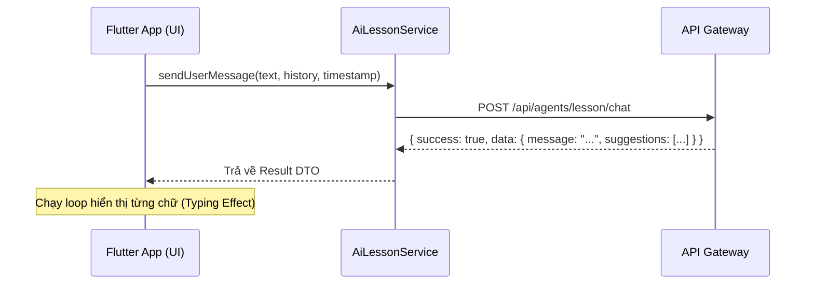

# Tài liệu Kỹ thuật Tích hợp AI Lesson Assistant (Mobile - Flutter)

Tài liệu này cung cấp hướng dẫn triển khai cực kỳ chi tiết về mã nguồn, mô hình dữ liệu (DTO) và logic nghiệp vụ để tích hợp Trợ lý AI bài học (Sensei) vào ứng dụng Flutter.

---

## 1. Kiến trúc Giao tiếp & Luồng dữ liệu

Hệ thống sử dụng REST API truyền thống. Hiệu ứng "AI đang gõ chữ" được thực hiện bằng cách mô phỏng (Simulation) ở phía Client để tăng trải nghiệm người dùng.



---

## 2. Mô hình Dữ liệu Chi tiết (Dart DTOs)

Để tích hợp thành công, bạn cần triển khai đúng cấu trúc Envelope (Lớp bọc) của hệ thống.

### A. Lớp bọc API chuẩn (StandardApiResponse)
Tất cả phản hồi từ Backend đều nằm trong cấu trúc này:

```dart
class StandardApiResponse<T> {
  final bool success;
  final T? data;        // Dữ liệu thực tế
  final String? message; // Thông báo lỗi (nếu có)
  final List<dynamic>? errors;

  StandardApiResponse({required this.success, this.data, this.message, this.errors});

  factory StandardApiResponse.fromJson(
    Map<String, dynamic> json, 
    T Function(Map<String, dynamic>) fromJsonT
  ) {
    return StandardApiResponse(
      success: json['success'] ?? false,
      data: json['data'] != null ? fromJsonT(json['data']) : null,
      message: json['message'] as String?,
      errors: json['errors'] as List<dynamic>?,
    );
  }
}
```

### B. DTO dữ liệu Chat (LessonChatDataDTO)
Đây là phần dữ liệu nằm bên trong trường `data` của Envelope:

```dart
class LessonChatDataDTO {
  final String message;          // Nội dung Markdown từ AI
  final List<String> suggestions;  // Danh sách câu hỏi gợi ý

  LessonChatDataDTO({required this.message, required this.suggestions});

  factory LessonChatDataDTO.fromJson(Map<String, dynamic> json) {
    return LessonChatDataDTO(
      message: json['message'] ?? '',
      suggestions: List<String>.from(json['suggestions'] ?? []),
    );
  }
}
```

---

## 3. Lớp Dịch vụ (Service Layer - Dio)

Ví dụ triển khai Gọi API hoàn chỉnh:

```dart
class AiLessonService {
  final Dio _dio = Dio(BaseOptions(baseUrl: 'https://api.yourdomain.com'));

  Future<StandardApiResponse<LessonChatDataDTO>> sendChat({
    required String lessonId,
    String? courseId,
    String? currentTimestamp,
    required String message,
    List<Map<String, String>> history = const [],
  }) async {
    try {
      final response = await _dio.post(
        '/api/agents/lesson/chat',
        data: {
          'lessonId': lessonId,
          'courseId': courseId,
          'currentTimestamp': currentTimestamp,
          'message': message,
          'history': history,
        },
        options: Options(headers: {
          'Authorization': 'Bearer YOUR_ACCESS_TOKEN',
        }),
      );

      return StandardApiResponse.fromJson(
        response.data, 
        (dataJson) => LessonChatDataDTO.fromJson(dataJson)
      );
    } catch (e) {
      return StandardApiResponse(success: false, message: 'Lỗi kết nối: $e');
    }
  }
}
```

---

## 4. Logic Xử lý UI Đặc thù

### A. Đồng bộ Thời gian Video (Timestamp Sync)
Khi gửi tin nhắn trong bài VIDEO, bắt buộc lấy `position` từ Video Player:
```dart
String formatDuration(Duration d) {
  final minutes = d.inMinutes;
  final seconds = d.inSeconds % 60;
  return '$minutes:${seconds.toString().padLeft(2, '0')}';
}
```

### B. Hiệu ứng Typing (Simulated Streaming)
Do API trả về toàn bộ text, hãy giả lập việc gõ chữ để UX tốt hơn:
```dart
void simulateTyping(String fullContent) async {
  String buffer = "";
  for (var char in fullContent.characters) {
    buffer += char;
    setState(() => currentDisplayMsg = buffer);
    await Future.delayed(const Duration(milliseconds: 15));
  }
}
```

---

## 5. Tính năng Chọn văn bản (Selection-to-Chat)

Dùng `SelectionArea` trong Flutter để lấy text bôi đen:

```dart
SelectionArea(
  contextMenuBuilder: (context, selectableRegionState) {
    return AdaptiveTextSelectionToolbar.buttonItems(
      anchors: selectableRegionState.contextMenuAnchors,
      buttonItems: [
        ...selectableRegionState.contextMenuButtonItems,
        ContextMenuButtonItem(
          label: 'Hỏi AI Sensei',
          onPressed: () {
            final text = selectableRegionState.processTextHandlers.handleCopy()?.text;
            // logic mở khung chat và gửi text kèm prefix "> "
          },
        ),
      ],
    );
  },
  child: MarkdownBody(data: content),
)
```

---

## 6. Danh sách Kiểm tra (Parity Checklist)

| Tính năng | Độ ưu tiên | Ghi chú |
| :--- | :---: | :--- |
| **Hide Time for Reading** | Tối quan trọng | Nếu `lesson.type == 'READING'`, ẩn sạch Icon Clock/Badge Time. |
| **Status UX** | Cần thiết | Nếu `transcriptionStatus == 'PROCESSING'`, hiển thị banner "AI đang bóc băng video, mốc thời gian có thể chưa đầy đủ". |
| **Bilingual Support** | Bắt buộc | Kết quả AI chứa tiếng Nhật (Kanji/Furigana). Đảm bảo Android/iOS đã cài font Nhật chuẩn. |
| **History Sliding Window**| Bắt buộc | Chỉ lưu và gửi 6 tin nhắn gần nhất. |
| **Markdown Rendering** | Bắt buộc | Dùng `flutter_markdown` để hiển thị Markdown chuẩn. |
| **Error Handling** | Cần thiết | Hiển thị `StandardApiResponse.message` nếu `success == false`. |

---

> [!IMPORTANT]
> **Data Privacy**: Tuyệt đối không gửi toàn bộ nội dung bài học từ Client lên API. Server sẽ tự động lấy dữ liệu bài học dựa trên `lessonId` bạn cung cấp.
